OTT Live TV Services (over-the-top)
===================================

Introduction
------------
If you've had Cable or Satellite service for more than year or two you've probably noticed your bill seems to be constantly rising. You may have even considered calling your provider before recalling the hassle of wading throw touch-tone or the dreaded voice menu system, all before being allowed the pleasure of holding for an indeterminate amount of time.

Companies often prey on the complacency of their customers by raising rates frequently after the first year or two. Most consumers won't bother to switch providers because gathering and evaluating the data to make an informed decision is complicated and time-consuming.

Streaming OTT Live TV (over-the-top) offers a modern alternative to cable or satellite service without the cost of renting decoder boxes for each TV. Progamming is delivered through your home internet connection in a similar manner to Netflix. In place of a typical set-top DVR unit, an app is used from a Smart TV or streamer such as Roku, Fire TV, or Apple TV.

Responding to this demand, legacy providers are now offering streaming IPTV from their own apps, avoiding costly decoder rental fees. However, a home internet connection from the TV provider is required for these services. As such, you must already have service from that provider available at your home address to take advantage.

The four surviving OTT TV providers all offer similar features and pricing to each other, and bill month-to-month with no contract. They only require a sufficiently fast internet connection to support the household's demand. To compare channel offerings see the [full channel breakdown](#). Click a provider from the tables below for a more infomation, or on the cost to visit their website.

| Provider | Channels | Locals | Cloud DVR | Streams | Cost |
| -------- | :------: | :----: | :-------: | :-----: | :--: |
| *Cable IPTV* |  |  |  |  |  |
| [Astound TV+](#Astound) | 160+ | All | 125 hr (3 mo) | Up to 5 | [$110/mo*](https://www.astound.com/evansville/shop/?tv=1) |
| [Spectrum Stream](#Spectrum) | 85+ | All | Upgrade | Unlimited (2 mobile) | [$45/mo*](https://www.spectrum.com/cable-tv/plans) |
| *OTT Live TV* |  |  |  |  |  |
| [DirecTV Stream](#DirecTV) | 90+ | No CW | Unlimited* (9 mo) | 20 (3 mobile) | [$80/mo](https://streamtv.directv.com/) |
| [Fubo TV](#Fubo) | 180+ | No PBS | Unlimited (9 mo) | 10 (2 mobile) | [$80/mo](https://www.fubo.tv/welcome) |
| [Hulu + Live TV](#Hulu) | 95+ | All | Unlimited (9 mo) | 2 (3 mobile) | [$77/mo](https://www.hulu.com/live-tv) |
| [YouTube TV](#Youtube) | 100+ | All | Unlimited (9 mo) | Up to 3 | [$73/mo](https://tv.youtube.com/welcome/) |

> ***Disclaimer:*** *Cable IPTV pricing above from an address fortunate enough to have 3 competing providers available. Visit provider's website for accurate information at your home. Links contain no affiliate codes, nor has compensation in any form been exchanged.*

### OTA Options (over-the-air)

Alternatively, a broadcast TV antenna may be used to receive 20+ local HD stations for free. The antenna can directly feed the ATSC tuners in most TVs, or a multi-tuner Network OTA DVR can allow both viewing and recording from devices on your home wifi. Add a Live TV provider like Sling TV to suppliment your the antenna with popular cable networks you miss when cutting the cord.

| Provider | Channels | Locals | Cloud DVR | Streams | Cost |
| -------- | :------: | :----: | :-------: | :-----: | :--: |
| *OTA Suppliments* |  |  |  |  |  |
| [Frndly TV](#Frndly) | 50+ | None | Upgrade | 1 | [$7/mo](https://try.frndlytv.com/) |
| [Philo TV](#Philo) | 70+ | None | Unlimited (12 mo) | Up to 3 | [$28/mo](https://www.philo.com) |
| [Sling TV](#Sling) | 30+ | None | 50 hrs | 1 (3 Blue) | [$40/mo](https://www.sling.com) |
| *Network OTA DVR* |  |  |  |  |  |
| [Tablo OTA DVR](#Tablo) | 20+ | All | 128GB (~50 hrs) | 2 (4 for $140) | [$0/mo*](https://www.tablotv.com/product/) |

Astound TV+
-----------
| Channels | Locals | Cloud DVR | Streams | Cost |
| :------: | :----: | :-------: | :-----: | :--: |
| 160+ | All | 125 hr (3 mo) | Up to 5 | [$110/mo*](https://www.astound.com/evansville/shop/?tv=1) |

<!-- Gallery Container Styles -->

<!-- Light Lightbox v1.3.4 - https://github.com/vaughnroyko/lightLightBox -->

<!-- Gallery elemement -->
<ol class="gallery">
	<li><a href="#" rel="lightbox">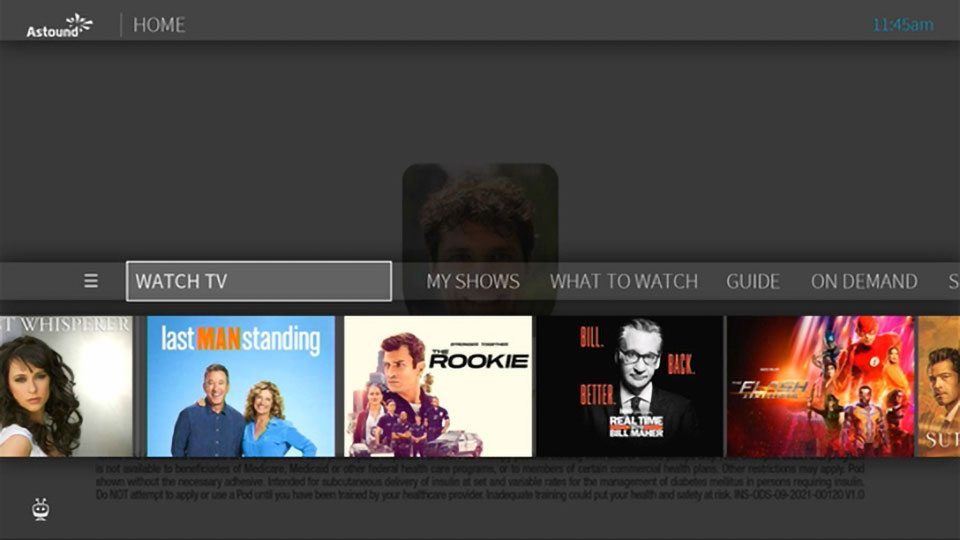</a></li>
	<li><a href="#" rel="lightbox">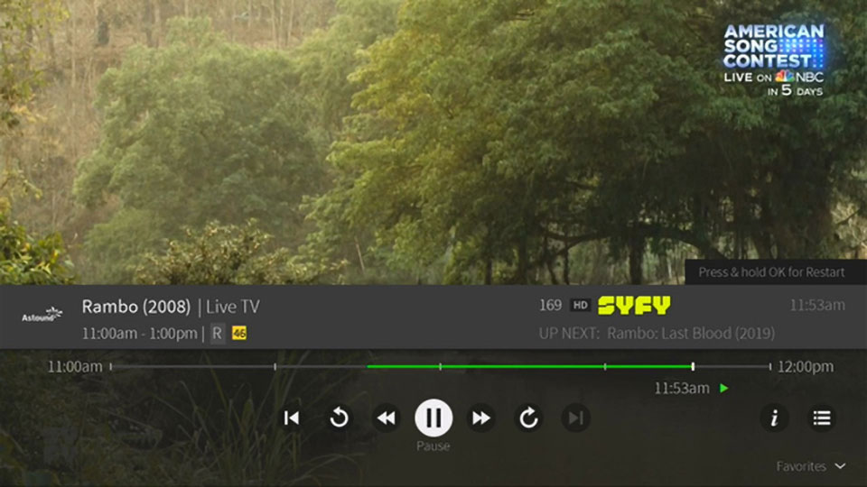</a></li>
	<li><a href="#" rel="lightbox">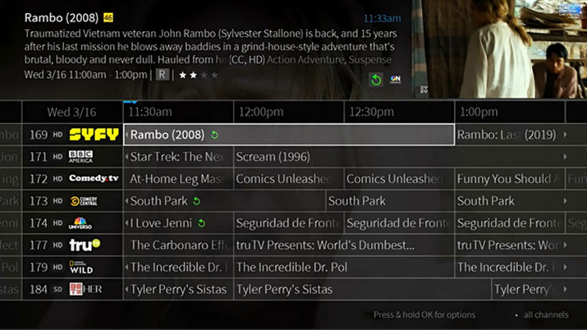</a></li>
	<li><a href="#" rel="lightbox">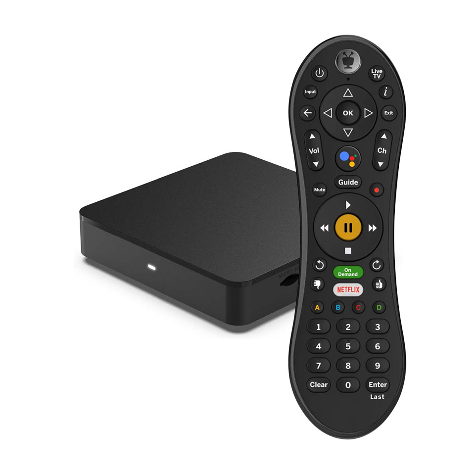</a></li>
</ol>

### Pros
- Familiar Tivo DVR Interface with channel numbers
- Large number of channels (padded by 50 Music Choice stations)
- Replay any program aired within the last 72 hours
- EVO Force 1 Android TV Box with Tivo & IR/BT Remote
	- Remote has number buttons & mic to dial in channels or use voice prompts
	- Remote can control both the TV and a seperate audio device via IR or CEC
	- Chromecast support allows casting media from mobile devices or Chrome browser
	- Front IR Receiver, 100 Mbps ethernet & optical audio outputs
- Can bundle with Astound Moble using T-Mobile's cell network

### Cons
- Required Astound Home Internet subscription
- Requires at least one Astound Box at $22/mo each
- Most expensive solution even before hidden fees
- Limited device support (No PCs, Rokus, etc)
- Limited Cloud DVR capacity with $10/mo upcharge to increase

Astound is in process of converting customers in the area from traditional receivers to their IPTV service. The legacy ClearQAM channels that could be tuned in nearly any TV in the 2 decades will be retired in late 2024 as part of this transition. Astound customers with many TVs may end up with hefty device rental fees for infrequently used rooms. An inexpensive Fire TV or Chromecast player can easily replace one with a monthly rental fee.

However, at least one Astound TV+ player must be rented for the IPTV service, in addition to the Astound home internet service requirement. The box itself is a very good approximation of your standard set-top DVR. Channels keep their numbers that can be keyed in from the densly packed Tivo-branded remote, or from a [Universal Remote](#). Channels can even be selected by pressing the voice command button and saying the network name or channel number. The app selection available from the Google Play Store is particularly great, but it does require a google account. It integrates well with the Google Smart Home ecosystem, and Chromecast support is a spectacular convience feature for sharing audio and video from your mobile device to the TV.

It's worth noting Astound does offer a cheaper $30 Basic IPTV plan, but it doesn't include much other than the local broadcast stations. Effectively an expensive alternative to an OTA antenna, but it might be valueable in certain use-cases.

Spectrum Stream
---------------
| Channels | Locals | Cloud DVR | Streams | Cost |
| :------: | :----: | :-------: | :-----: | :--: |
| 85+ | All | Upgrade | Unlimited (2 mobile) | [$45/mo*](https://www.spectrum.com/cable-tv/plans) |

<ol class="gallery">
	<li><a href="#" rel="lightbox">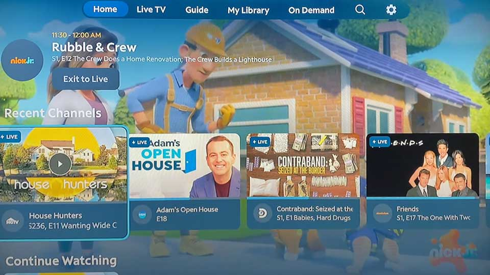</a></li>
	<li><a href="#" rel="lightbox">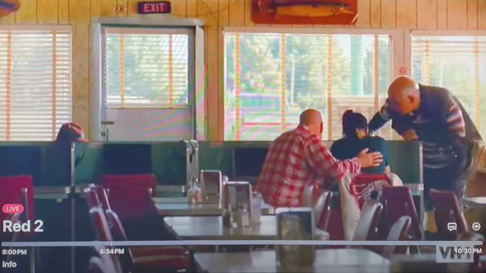</a></li>
	<li><a href="#" rel="lightbox">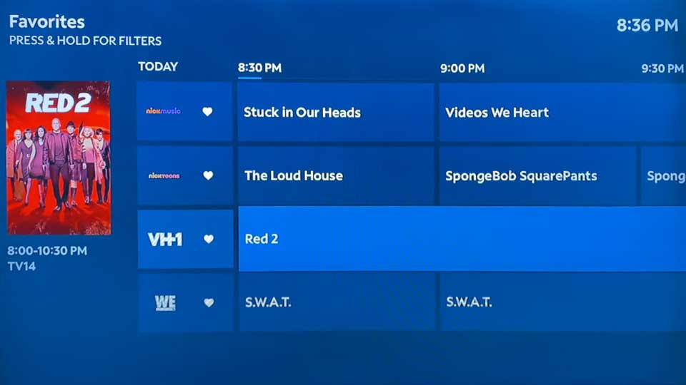</a></li>
	<li><a href="#" rel="lightbox">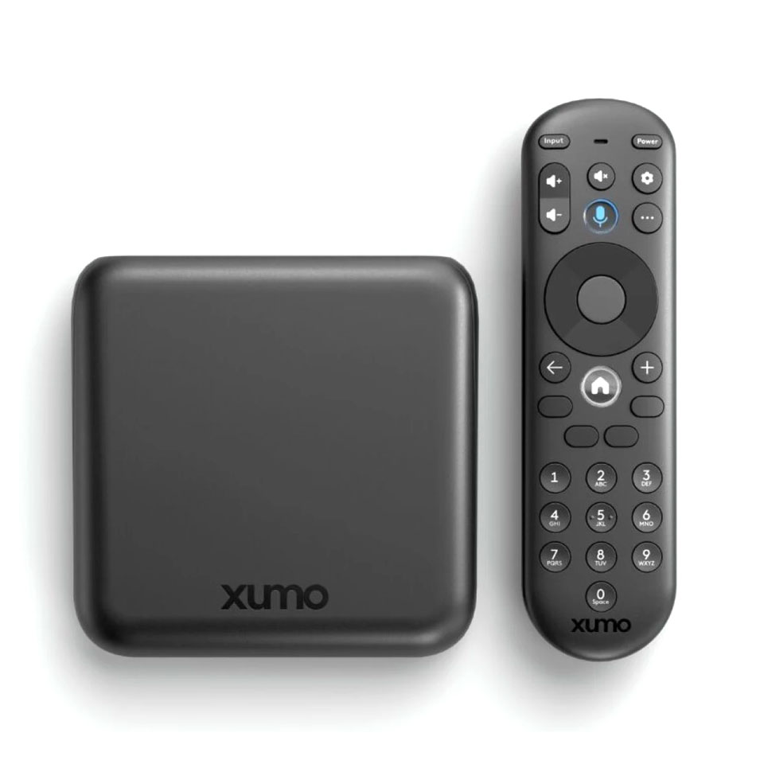</a></li>
</ol>

### Pros
- Cheapest solution with all locals and a decent selection of cable networks
- Can be upgraded for better channel selection and premiums
- Optional Xumo Player & Remote
	- Remote has number buttons & mic to dial in channels or use voice prompts
	- Remote can control both the TV and a seperate audio device via IR or CEC
	- Front panel IR Receiver & Gigabit Ethernet port
	- Can be purchased outright for $60 or $5/mo over a year
- Can bundle with Spectrum Moble using Verizon's cell network

### Cons
- Requires Spectrum Home Internet subscription
- No Cloud DVR included; 50 or 100 shows with 90 days for $5 or $10/mo upgrades
- No Apps for Android TV devices or Many Smart TVs
- Disney, ESPN, TNT, TBS & USA networks not included in base plan

The Spectrum TV app is available to virtually any customer with TV service, though you will need spectrum account credentials to log in. While Spectrum Home internet service is needed for the cheapest Spectrum Stream plan, though no hardware rental is required. This budget package omits some popular networks and lacks a Cloud DVR without additional charges, however. Spectrum is more than happy to sell you additional channels and services for more per month.

The Spectrum TV app is still unavailable on Android TV devices and many Smart TVs. A Spectrum branded Xumo Stream Box is available for a $5/mo rental fee or can be purchased outright for $60 or $5/mo over a year. There is a good selection of apps available from its proprietary app store. The included Voice Remote retains number keys to direct-dial channels, and can control a seperate TV and audio device. It can also be controlled by a [Universal Remote](#) from the IR receiver on the front.

If the channels dropped from this package aren't important, it offers the best value when bundled with Spectrum home internet. This plan is clearly designed to boost quarterly subscriber numbers by undercutting OTT providers like YouTube TV.

DirecTV Stream
--------------
| Channels | Locals | Cloud DVR | Streams | Cost |
| :------: | :----: | :-------: | :-----: | :--: |
| 90+ | No CW | Unlimited* (9 mo) | 20 (3 mobile) | [$80/mo](https://streamtv.directv.com/) |

<ol class="gallery">
	<li><a href="#" rel="lightbox">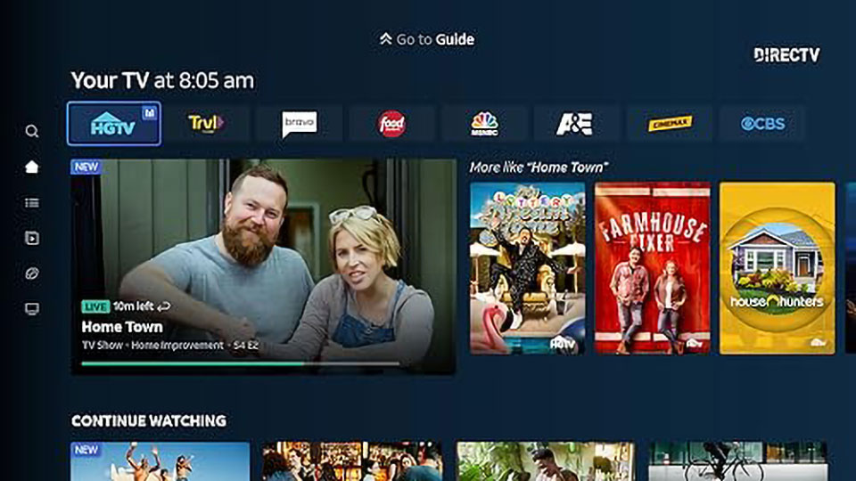</a></li>
	<li><a href="#" rel="lightbox">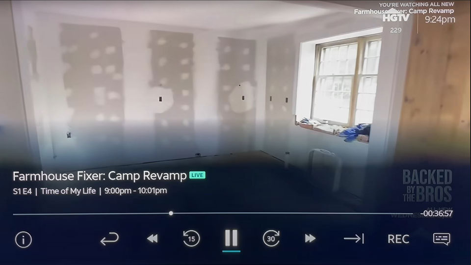</a></li>
	<li><a href="#" rel="lightbox">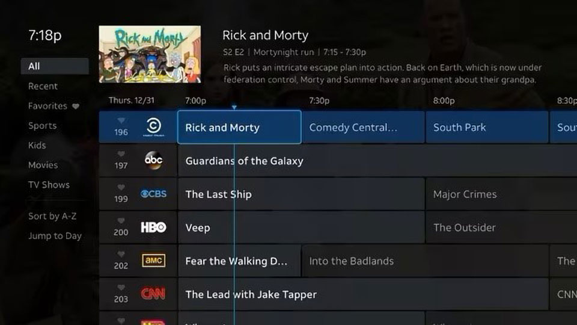</a></li>
	<li><a href="#" rel="lightbox">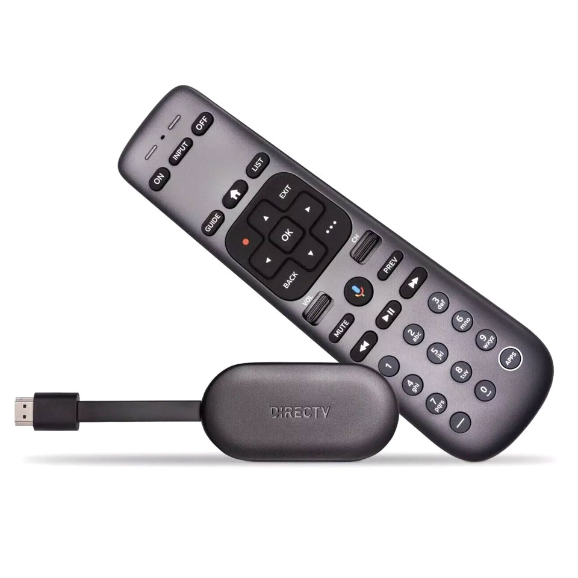</a></li>
</ol>

### Pros
- Familiar interface & channel numbers for Satellite converts
- Unlimited DVR with single show or series recording options
- Good selection of regional sports networks based on home location
- Optional DirecTV Gemini Air Android TV Box & Remote
	- Remote has number buttons & mic to dial in channels or use voice prompts
	- Remote can control both the TV and a seperate audio device via IR or CEC
	- Chromecast support allows casting media from mobile devices or Chrome browser
- Can bundle with AT&T Mobile or Home Internet services for discounts

### Cons
- No local CW affliate in channel lineup
- Series recordings limited to 30 episodes
- Gemini boxes require flat $15/mo Advanced Receiver fee to use
- Gemini Air has no IR, ethernet or audio outputs other than HDMI

Formerly AT&T TV and before that DirecTV Now, DirecTV Steam seems to rebranded itself every few years. While it's often bundled with AT&T Fiber internet, it works fine with other provider's internet services as well. Those familiar with DirecTV satellite offerings will be comfortable within the DirecTV Stream app, which still features numbered channels. 

DirecTV Gemini and Gemini Air players include a fully functional voice remote with numeric keys and the ability to control a seperate TV and Audio device. Built on the Android TV platform, the Google Play Store offers a good selection of app, but required a google account to use. Voice control and Chromecast support along with Google Home integration make it a good option for Android-centric household especially. Be advised there is a flat $15/mo Advanced Receive fee added to any account with one or more Gemini player in use. This fee seems especially excessive for what it is actually giving you.

The local CW affiliate doesn't appear to be available, but otherwise the channel selection is very good. DirecTV offers one the best selections of regional sports networks of any provider, if you are a sports fan. The concurrent stream count is very generous compared to the competition. However the 30 episode limit on series recordings in the Cloud DVR feels petty, though is likely a concern for almost no one.

DirecTV Stream is the most similar of the OTT Live TV services to traditional cable or satellite equipment. Users hesitant to move to an OTT solution might feel less friction with DirecTV's product, espcially when paired with a Gemini player and remote.

Fubo TV
-------
| Channels | Locals | Cloud DVR | Streams | Cost |
| :------: | :----: | :-------: | :-----: | :--: |
| 180+ | No PBS| Unlimited (9 mo) | 10 (2 mobile) | [$80/mo](https://www.fubo.tv/welcome) |

<ol class="gallery">
	<li></li>
	<li></li>
	<li></li>
</ol>

### Pros
- Sports-centric streaming solution with most locals
- Largest number of channels provided in the base package
- International friendly with a stand-alone $25 budget Latino package
- Offers full 270 channel bundled with Paramount Plus & Showtime for $100

### Cons
- Lacks many popular cable networks like AMC, Discovery, History, TBS, & TNT
- No local PBS affiliate available
- Smaller niche provider with less mature product/software

Hulu + Live TV
--------------
| Channels | Locals | Cloud DVR | Streams | Cost |
| :------: | :----: | :-------: | :-----: | :--: |
| 95+ | All | Unlimited (9 mo) | 2 (3 mobile) | [$77/mo](https://www.hulu.com/live-tv) |

<ol class="gallery">
	<li><a href="#" rel="lightbox">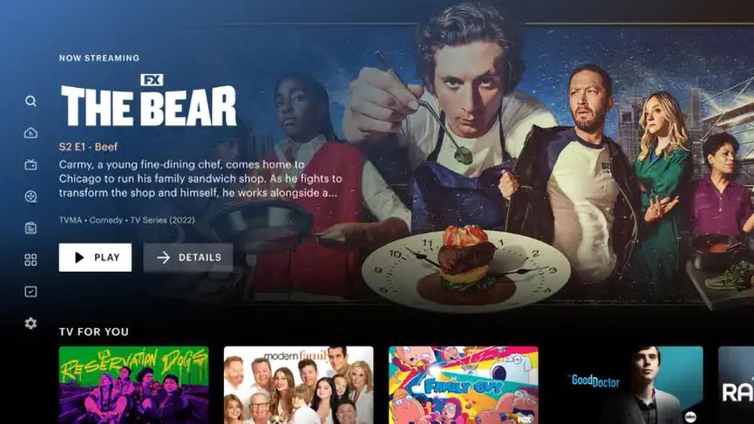</a></li>
	<li><a href="#" rel="lightbox">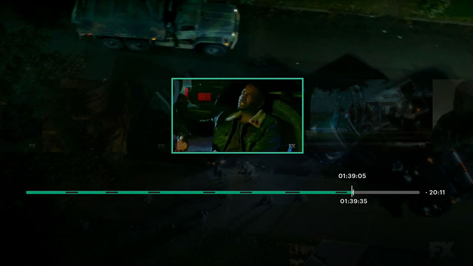</a></li>
	<li><a href="#" rel="lightbox">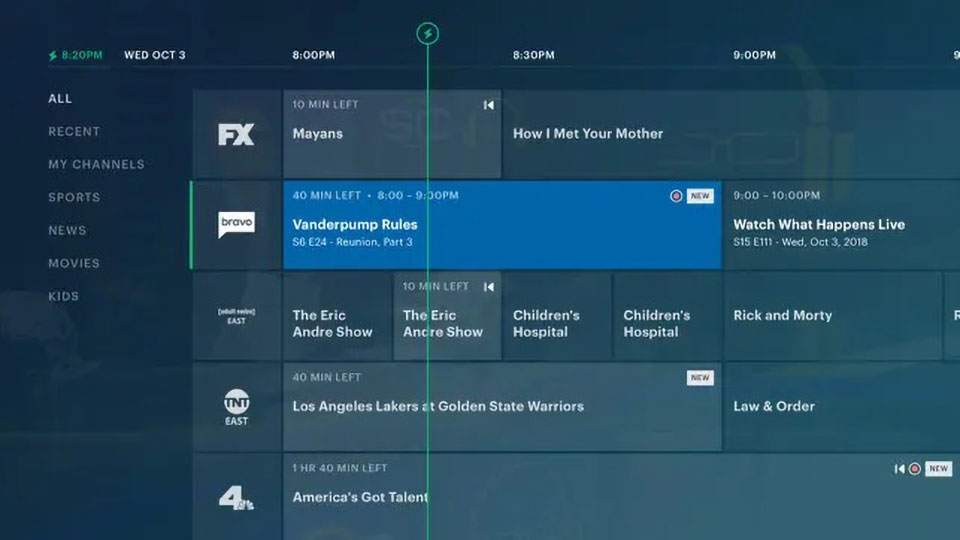</a></li>
</ol>

### Pros
- Unlimited DVR with options for single, new only, or all episode recording
- Base plan includes free Disney+, ESPN+, & Hulu ad-supported tiers
- Upgrade to ad-free Disney+ & Hulu tiers for $13/mo
- Single app for streaming Live TV and Hulu's on-demand library

### Cons
- 2 simultanious stream limitation without $10 Unlimited Screens upgrade
- AMC Network channels not available
- Known problems with 5G Home Internet from T-Mobile, Verizon, etc

YouTube TV
----------
| Channels | Locals | Cloud DVR | Streams | Cost |
| :------: | :----: | :-------: | :-----: | :--: |
| 100+ | All | Unlimited (9 mo) | Up to 3 | [$73/mo](https://tv.youtube.com/welcome/) |

<ol class="gallery">
	<li><a href="#" rel="lightbox">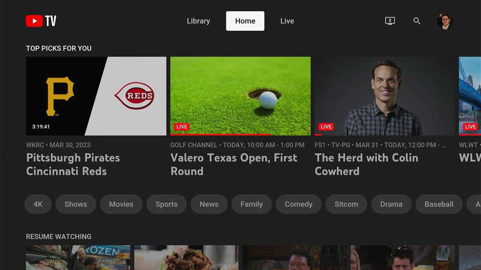</a></li>
	<li><a href="#" rel="lightbox">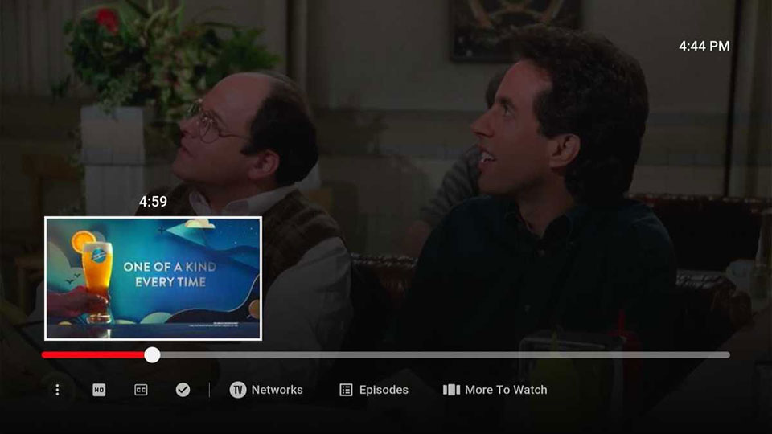</a></li>
	<li><a href="#" rel="lightbox">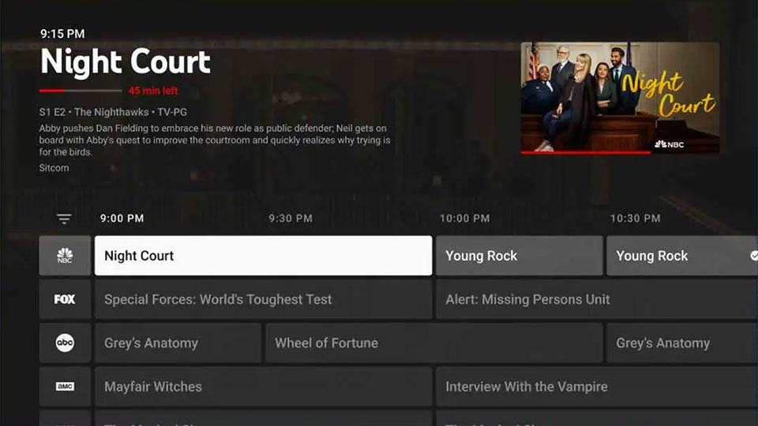</a></li>
</ol>

### Pros
- Best 4K and Surround Sound support (on certain devices)
- Best selection of cable networks included in the base package
- Relevant content suggestions and searching via voice on certain devices

### Cons
- Least similar to traditional DVR set-top boxes
- No way to record an individual episode or delete watched ones
- No favorite channels; Can create custom Guide list from web browsers only
- A&E & History Channel networks are unavailable
- Requires google account(s) for user sign in

Frndly TV
---------
| Channels | Locals | Cloud DVR | Streams | Cost |
| :------: | :----: | :-------: | :-----: | :--: |
| 50+ | None | Upgrade | 1 | [$7/mo](https://try.frndlytv.com/) |

<ol class="gallery">
	<li><a href="#" rel="lightbox">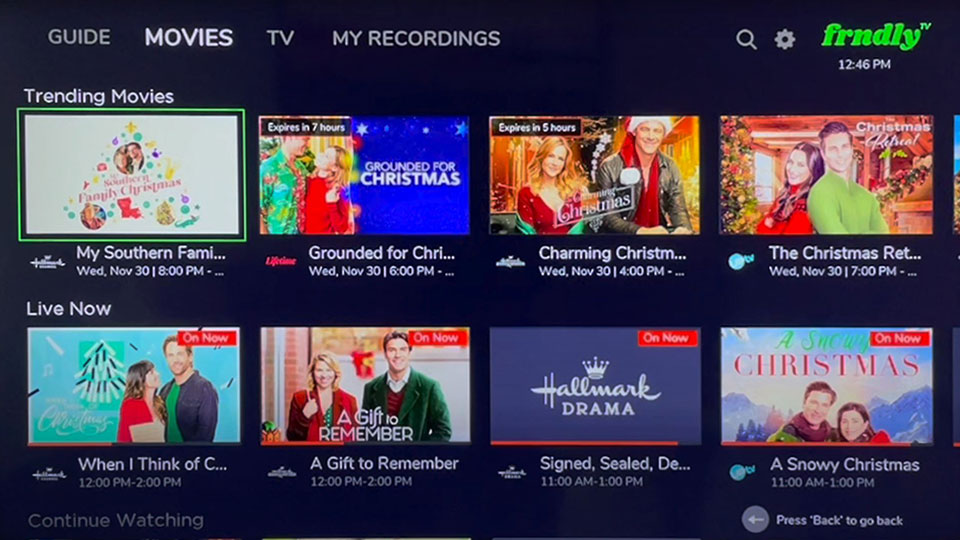</a></li>
	<li><a href="#" rel="lightbox">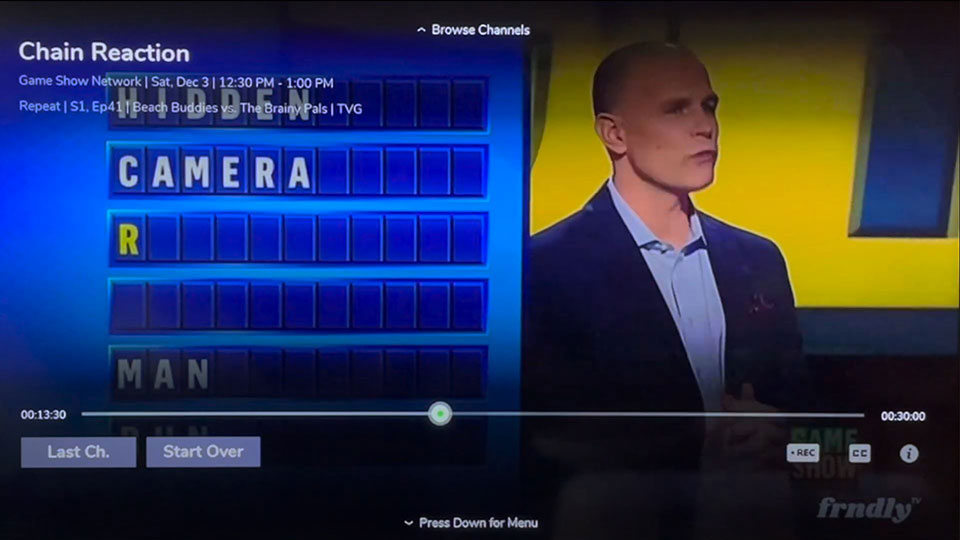</a></li>
	<li><a href="#" rel="lightbox">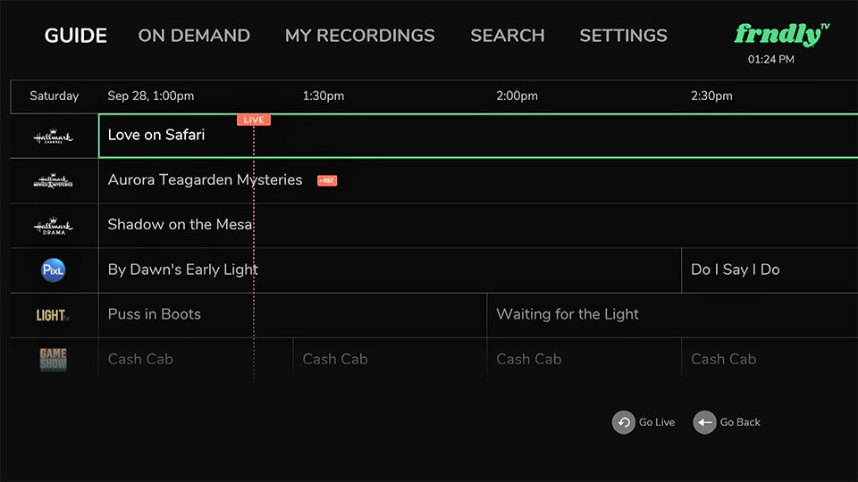</a></li>
</ol>

### Pros
- An assortment of family-friendly channels with kid-safe content
- Replay any program aired within the last 72 hours

### Cons
- Very niche set of offered channels that isn't appealing to many
- DVR and multiple streams requires $2 upgrade(s) from Base plan

Philo TV
--------
| Channels | Locals | Cloud DVR | Streams | Cost |
| :------: | :----: | :-------: | :-----: | :--: |
| 70+ | None | Unlimited (12 mo) | Up to 3 | [$28/mo](https://www.philo.com) |

<ol class="gallery">
	<li><a href="#" rel="lightbox">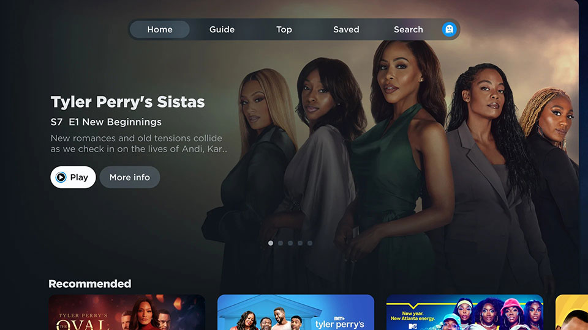</a></li>
	<li><a href="#" rel="lightbox">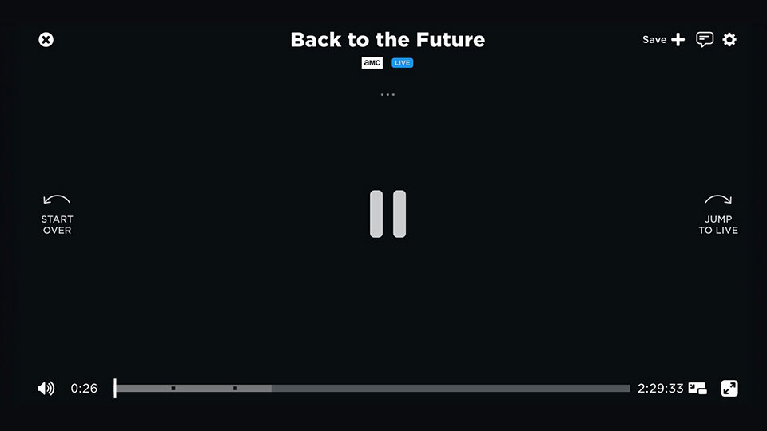</a></li>
	<li><a href="#" rel="lightbox">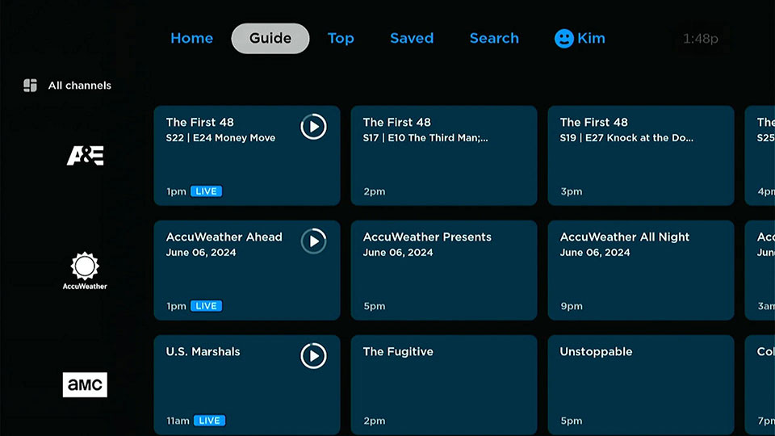</a></li>
</ol>

### Pros
- A handful of cable networks with a Cloud DVR on a budget
- Good value for the number of channels offered
- Includes unlimited Cloud DVR with a 12 month expiry time

### Cons
- No ESPN/Disney, Turner, USA, Fox stations; virtually no News or Sports
- Missing too many popular channels for all but the most thrifty households

Sling TV
--------
| Channels | Locals | Cloud DVR | Streams | Cost |
| :------: | :----: | :-------: | :-----: | :--: |
| 30+ | None | 50 hrs | 1 (3 Blue) | [$40/mo](https://www.sling.com) |

<ol class="gallery">
	<li><a href="#" rel="lightbox">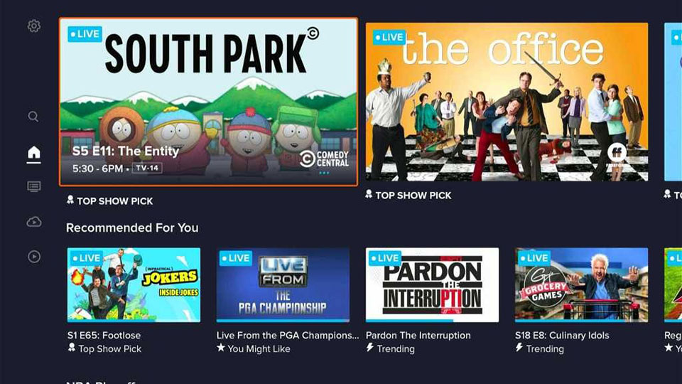</a></li>
	<li><a href="#" rel="lightbox">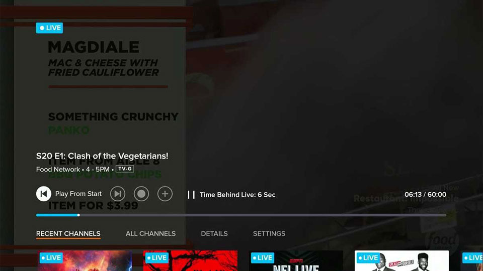</a></li>
	<li><a href="#" rel="lightbox">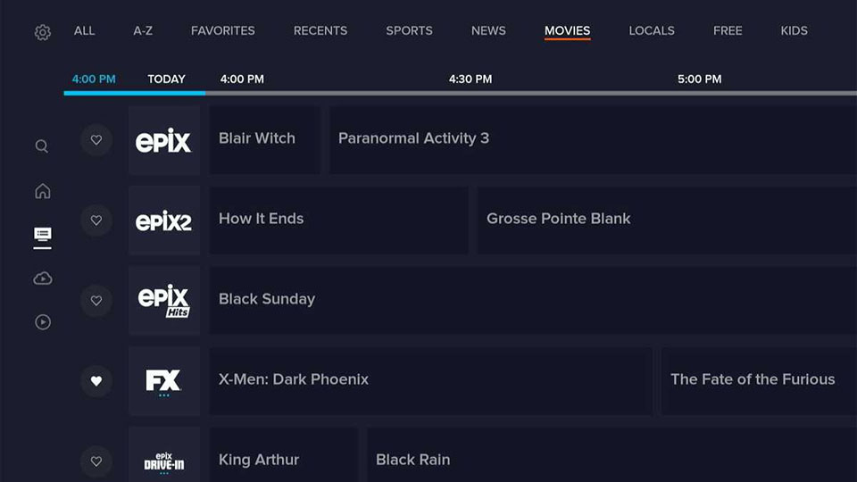</a></li>
</ol>

### Pros
- Offers two $40 base plans with different channels or both for $55
- Blue has Discovery, FX, FS1, Fox News, MSNBC, NatGeo, SYFY, USA, etc
- Orange trades those for Disney channel and ESPN networks
- Offers a good selection of cable networks to suppliment an OTA antenna

### Cons
- Confusing Orange/Blue bundles and limitations due to content licenses
- May not suitable for large households due to stream limits (max 4 with both)
- Limited 50 hours of Cloud DVR included; $5/mo upgrades to 200 at most

Tablo (4th Gen OTA Tuner)
-------------------------
| Channels | Locals | DVR | Streams | Cost |
| :------: | :----: | :-------: | :-----: | :--: |
| 20+ | All | 128GB (~50 hrs) | 2 (4 for $140) | [$100 ($0/mo)](https://www.tablotv.com/product/) |

<ol class="gallery">
	<li><a href="#" rel="lightbox">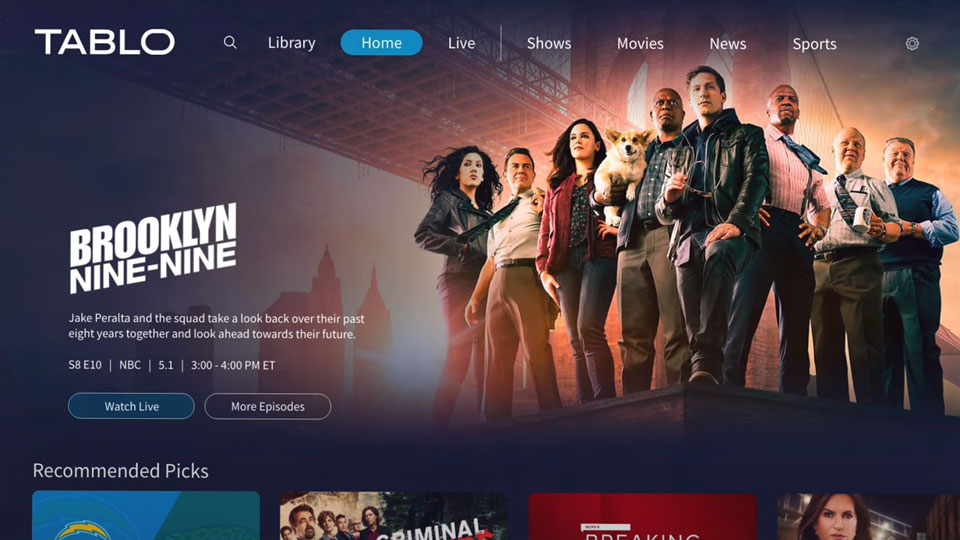</a></li>
	<li><a href="#" rel="lightbox">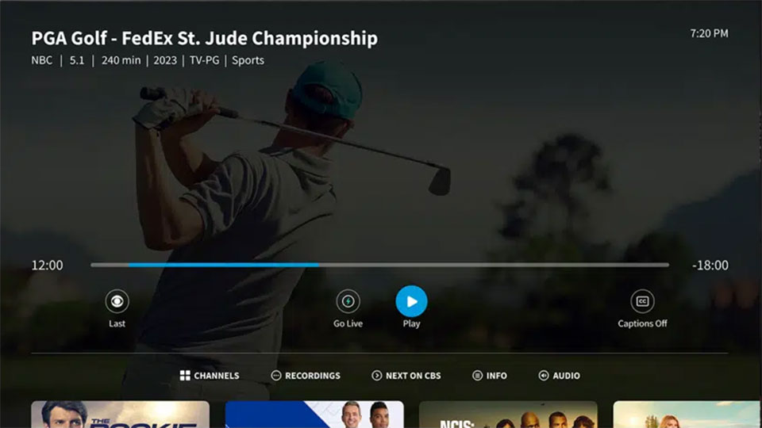</a></li>
	<li><a href="#" rel="lightbox">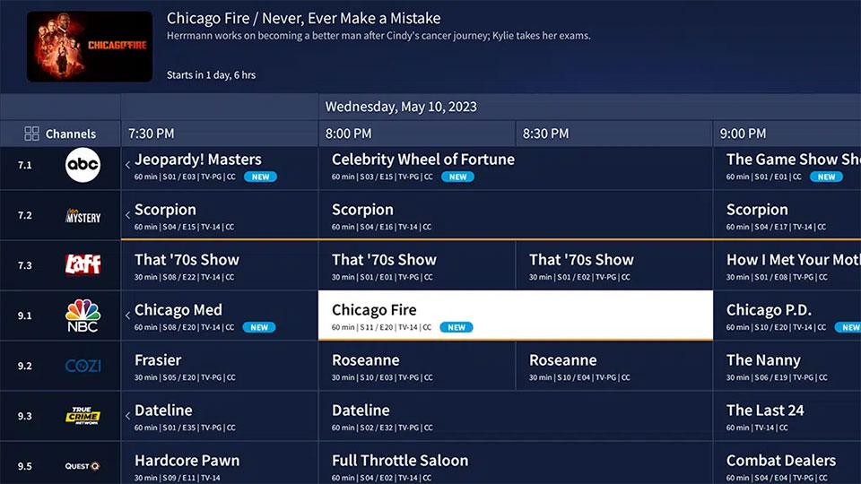</a></li>
</ol>

### Pros
- Receive 20+ local broadcast channels for free with an antenna
- Available in 2 or 4 tuner models to stream and record at the same time
- Internal DVR storage expandable up to 8 TB (~3000 hrs) via USB 3.0 port
- Adds a few dozen Free Ad-Supported channels that are also recordable

### Cons
- Require OTA antenna typically in attic or on mast outside
- Limited app support, with Apple TV & most Smart TVs still unsupported
- No Windows/Mac app, PWA or web browser supported
- Will not work at all if internet connection is down
